# Diet planner
***
#### Author: Samuel Ferrara
#### Project Group XX

## Project Description
***
This project was bootstrapped with [Create React App](https://github.com/facebook/create-react-app).

A webb application where users can tailor a diet plan after their own personal taste, goals and approximated energy expenditure. 


* The project architecture follows the Model-View-Presenter architecture pattern.
  

* [edamam API](https://developer.edamam.com/edamam-docs-nutrition-api) has been used for ingredient data and images

 
* Redux and react context has been utilized for state management.


* Firebase has been used for data persistance and user authentication.

The [React-Redux-Firebase API](https://react-redux-firebase.com/) has been used to create bindings between
redux and firebase.
### The Application

#### Registration
The user will be able to register an account 
by submitting account details (email and password) and personal information that the application uses to
approximate their total daily energy expenditure. The personal information which is needed includes 
current physical activity, height, weight, age and gender. 
Screenshots from the signup process are presented below.

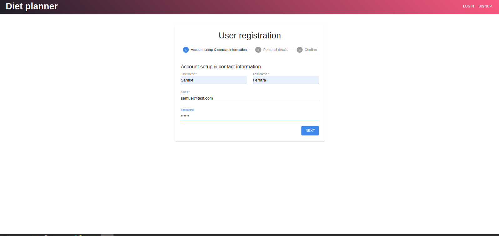 

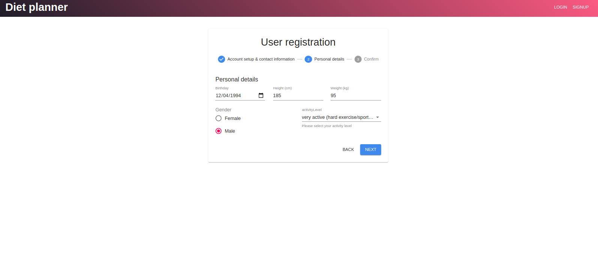

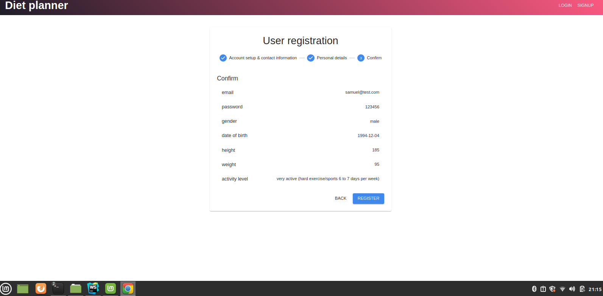

#### User profile
The user can update their personal information at any given time, 
every update will be stored together with their current diet plan so that the users progress can be tracked and visualized.
However, tracking and visualization of the users progress has not yet been implemented, more information on what is left to do
can be found under the [Left to do](#Left-to-do) section of this document.

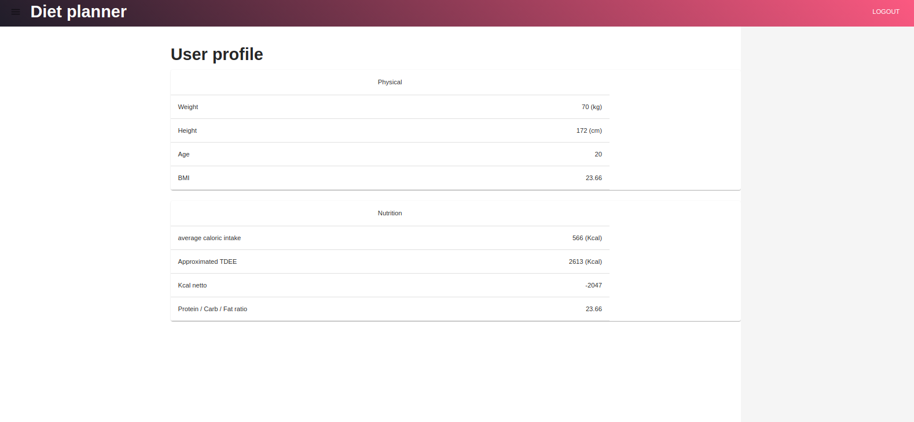


Unfortunately the update functionality is not fully styled or implemented yet, 
when the form is submitted, the profile is updated. 
However updates are not saved at this point in time.

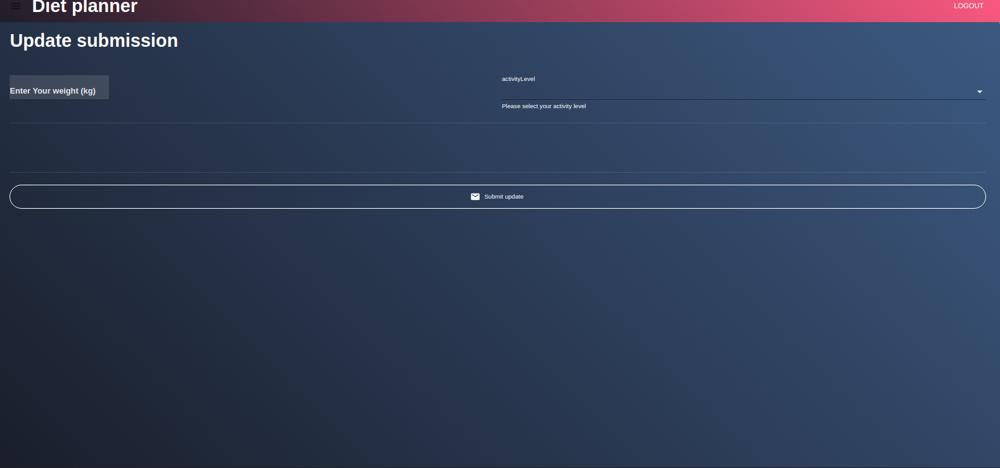


#### The diet plan
The diet plan that is created by the user consist of meal categories that are given a name and a priority at creation, 
where the priority indicates in what order to consume the meals.
(e.g. Breakfast with priority 1, Midday snack with priority 2, Lunch with priority 3 etc).

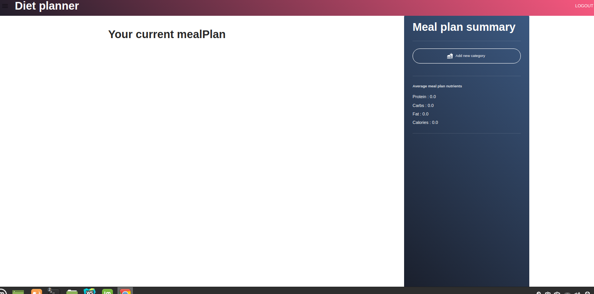
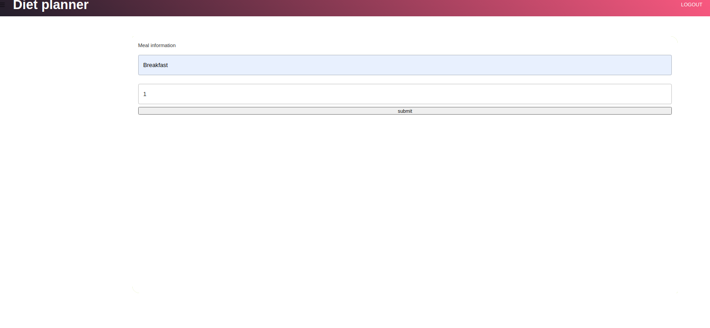
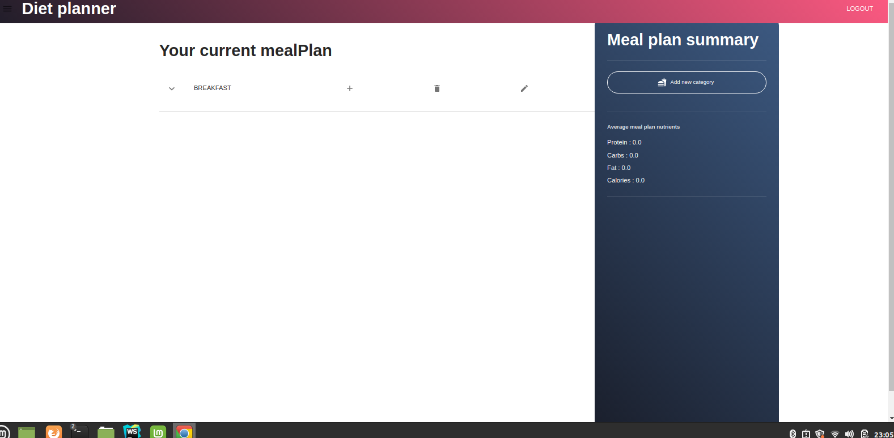

When a category is created, meals can be composed and added by searching and adding ingredients to the  
category. Note that **ingredientSearch** and **ingredientDetails** have not been styled yet.

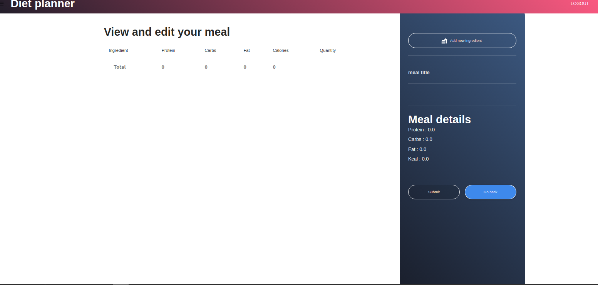
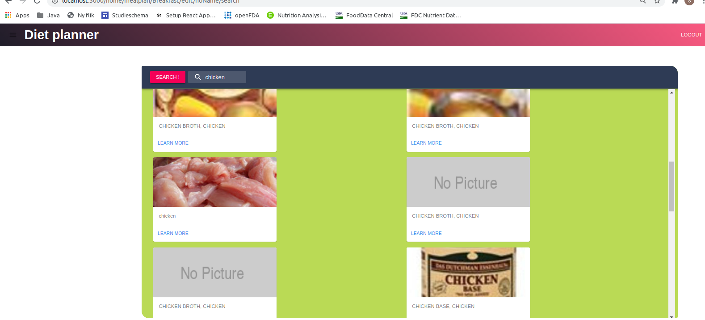
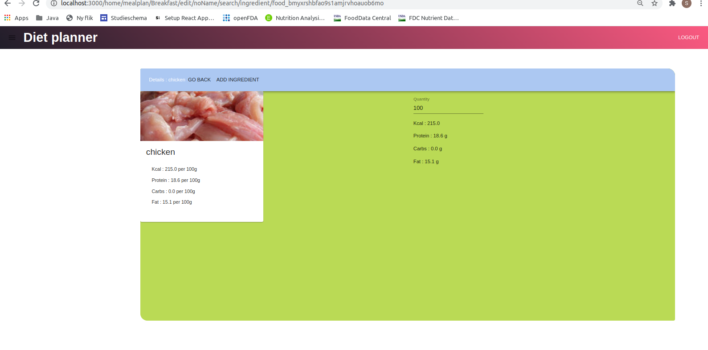
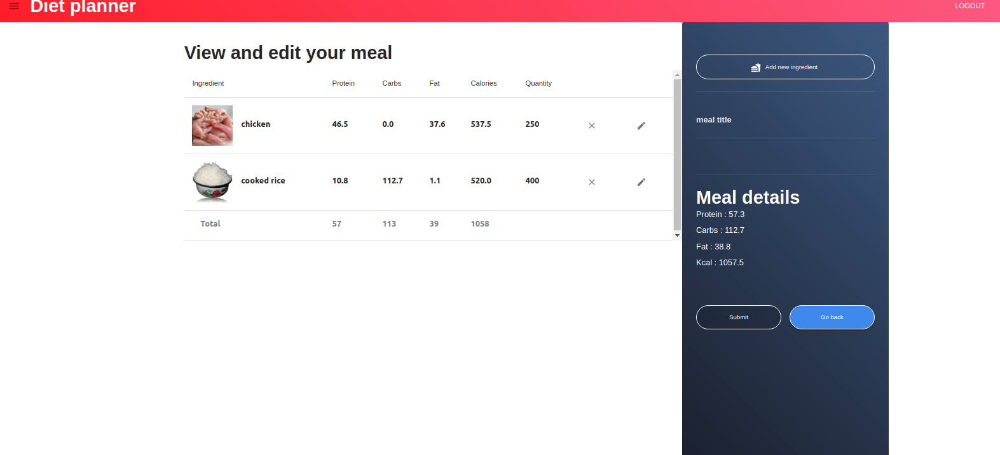


##### Live Demo: https://diet-planner-1.herokuapp.com

### Left to do
This section provides a list of work that needs to be done before the final deadline at december 21 2020

- [ ] Fix loading screens
- [ ] Fix alert message in login & signup view
- [ ] Style UpdateForm view
- [ ] Fix styling and functionalities in IngredientSearch and IngredientDetails
    - Add functionality to sort ingredient search results by nutrients
    - Add functionality to see how total nutrients in current meal is affected by adding an ingredient
      directly from ingredient details
- [ ] Add functionality to track progress
    - Store all updates together and current mealplan with timestamp
    - Functionality to revert your meal plan to how it was at any given update
    - Add charts etc to visualise the users progress in user profile (planning to do so in a sidebar on the right)
 
### Installation & setup
*** 
The application is bootstraped with create-react-app which gives a straight forward setup and installation
1. install npm dependencies
````
> npm install
````
2. run the application in development mode
````
> npm start
````
3. The application will be hosted at localhost:3000

***
## File Structure

### dietplanner/public
Contains all global and static files :
*  public/index.html
    * Contains the static HTML file and contains the following :
    * The title showed in the browser tab
    * ``` <div id="app-root"></div> ``` that is populated to show the main application.
    * ``` <div id="modal-root"></div> ``` that is populated to display modal components that go over the main application view
      

### dietplanner/src
Contains the application source code,
including all views, models, presenters, services, 
configuration and utilities.


#### src/model
Contains the application domain model

###### model/actions
* ***model/actions/actionsTypes.js***
  * constants js objects that defines the action types


*  ***model/actions/ingredient.js***
   * Action creators and action dispatchers responsible 
         for dispatching actions related to manipulation of
         the **currentIngredient** model.


*  ***model/actions/meal.js***
   * Action creators and action dispatchers responsible
          for dispatching actions related to manipulation of
          the **currentMeal** model.


* ***model/actions/mealCategory.js***
  * Action creators and action dispatchers responsible
         for dispatching actions related to manipulation of
         the **currentMealCategory** model.


   * ***model/actions/user.js***
       * Action creators and action dispatchers responsible
         for dispatching actions related to user authentication as well as
         manipulation of firebase resources including the **firebase** and **firstore** model.


###### model/reducer
 * ***model/reducer/ingredientReducer.js***
   * Contains redux reducer responsible for the **currentIngredient** model.


 * ***model/reducer/mealCategoryReducer.js***
   * Contains redux reducer responsible for the **currentMealCategory** model


* ***model/reducer/mealReducer.js***
   * Contains redux reducer responsible for the **currentMeal** model


* ***model/reducer/rootReducer.js***
   * Contains a combined reducer created from the applications reducers, also persist the above 
     reducers to local state *(might change this to be persisted in firestore instead)*
   * Includes **firestoreReducer** and **firebaseReducer** from the ***react-redux-firebase*** API, 
     these reducers are responsible for changes in everything that is persisted in firebase
     which includes user authentication and models like the **userProfile** and **mealPlan**.


#### src/view
###### view/common
* Contains generic child components that are used in multiple views to reduce code complexity.

##### view/form
Contains all form views that are used in the application
* ***view/form/signup***
    * Contains view components that make up a multi step form to be filled by the user at registration.
    
* ***view/form/login.js***
    * Login form that renders a form to be filled by the user at login.
    
* ***view/form/createMealForm.js***
    * Form to be filled by the user when creating a new meal category, 
      wrapped in the **Modal** component that is rendered on top of the main view from ``<div id="modal-root"></div>`` in ***public/index.html***

##### view/navigation
Contains view components related to navigating through the application


##### view/style
Contain files related to styling of view components


##### view/user
Contains view components related to the user, such as the user profile and 
views regarding the meal plan.


***